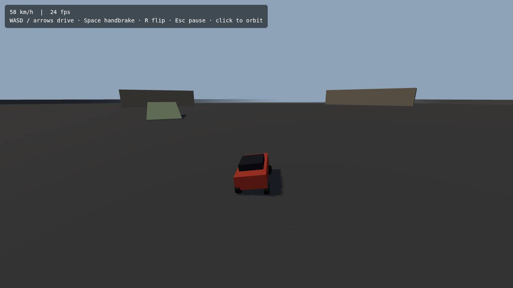

# ZombiePurge

A 3D zombie-smashing vehicular combat sandbox game built with Three.js, TypeScript, and Vite.



## Quick Start

```bash
# Install dependencies
npm install

# Run dev server (http://localhost:5173)
npm run dev

# Build for production
npm run build

# Run tests
npm run test

# Lint code
npm run lint

# Check types
npm run type-check
```

## Controls

| Action | Keyboard | Gamepad |
|---|---|---|
| Drive / reverse | W / S or arrow keys | Right / left trigger |
| Steer | A / D or arrow keys | Left stick |
| Handbrake | Space | A |
| Flip reset (when upside down) | R | Y |
| Pause | Esc / P | Start |
| Orbit camera | Click the game, then move the mouse | Right stick (coming with the HUD work) |

Controls are rebindable; bindings persist in `localStorage`.

## Project Structure

```
src/
  ├── core/        # Engine loop, state machine, physics
  ├── game/        # Game mechanics, car, zombies, economy
  ├── ui/          # HUD, menus, screens
  ├── data/        # Config loaders, data models
  ├── main.ts      # Entry point
  └── style.css    # Global styles

tests/             # Unit tests (Vitest)
assets/            # 3D models, textures, sounds
```

## Game Design

**Genre:** 3D open-area vehicular combat sandbox

**Core Loop:**
1. Drive across a large map
2. Find and run over/shoot zombies
3. Earn coins by rank and distance
4. Buy upgrades (weapons, armor, engine, fuel, tires)
5. Progress through 5 story maps or play infinite sandbox

**Key Features:**
- Third-person chase camera behind/above car
- 5 zombie types (Walker, Runner, Spitter, Brute, Tank)
- Visibility advantage: player sees 300m, zombies detect at 40–80m
- Economy: coins by rank + distance bonus (1 coin/250m)
- Shop system with tiered upgrades
- Story Mode (5 maps) + Sandbox Mode
- Fuel system, HP, armor, minimap/radar

## Milestones

| # | Goal | Status |
|---|------|--------|
| **M0** | Foundation (scaffold, car, camera) | ✅ Done (A1–A7) |
| **M1** | Zombie Smash Prototype (zombies, coins, demo) | 🔨 Next |
| **M2** | Shop & Upgrades | ⬜ TODO |
| **M3** | Sandbox Mode (first playable) | ⬜ TODO |
| **M4** | Story Mode: Map 1 (Suburbs) | ⬜ TODO |
| **M5** | Story Mode: Maps 2-5 | ⬜ TODO |
| **M6** | Polish & Release | ⬜ TODO |

## What's Built So Far

- **A1** Vite + TypeScript + Three.js + Rapier scaffold with ESLint, Prettier, Vitest
- **A2** Fixed-step game loop (60 Hz physics, variable-rate render) and state machine
- **A3** Raycast-suspension car on a Rapier rigid body: drive, brake, reverse, handbrake, air control, flip reset
- **A4** Third-person chase camera: speed-based pull-back and FOV, orbit with auto-recenter, wall collision
- **A5** Keyboard + gamepad input with rebindable, persisted bindings
- **A6** 500 m greybox arena: walls, ramps, slalom boxes, pillar grid
- **A7** Typed, validated config for physics, vehicle, camera, zombies, rewards and maps

## Development

- **Language:** TypeScript (strict mode)
- **Build:** Vite + ESBuild
- **Physics:** Rapier 3D (dimforge/rapier3d-compat)
- **Renderer:** Three.js
- **Testing:** Vitest
- **Linting:** ESLint + Prettier
- **CI/CD:** GitHub Actions (lint + test on PR, build + deploy on merge)

## Tickets & Issues

See the [GitHub Issues](https://github.com/jackgary86-dev/ZombiePurge/issues) for the full ticket backlog (85 tickets across 11 epics, M0–M6).

Each ticket is tagged with:
- **Epic:** A–K (11 epics)
- **Milestone:** M0–M6
- **Priority:** high/medium/low
- **Category:** core, ai, gameplay, economy, shop, story, etc.

## License

TBD
