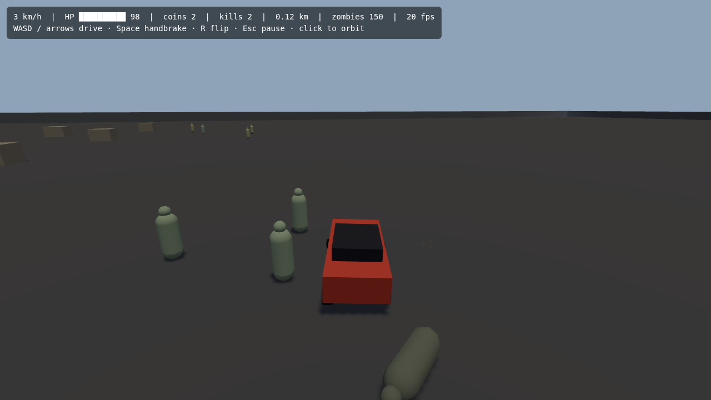

# ZombiePurge

A 3D zombie-smashing vehicular combat sandbox game built with Three.js, TypeScript, and Vite.

**▶ Play the live demo:** https://jackgary86-dev.github.io/ZombiePurge/ — rebuilt automatically on every merge to `main` (the build number and commit hash are shown in the bottom-right corner). Add `#autoplay` to the URL to watch the car hunt zombies by itself.



## Quick Start

```bash
# Install dependencies
npm install

# Run dev server (http://localhost:5173)
npm run dev

# Build for production
npm run build

# Run tests
npm run test

# Run tests with a coverage report
npm run test:coverage

# Lint code
npm run lint

# Check types
npm run type-check
```

## Controls

| Action                        | Keyboard                            | Gamepad                                |
| ----------------------------- | ----------------------------------- | -------------------------------------- |
| Drive / reverse               | W / S or arrow keys                 | Right / left trigger                   |
| Fire                          | F or left click                     | Right bumper                           |
| Nitro                         | Shift                               | X                                      |
| Steer                         | A / D or arrow keys                 | Left stick                             |
| Handbrake                     | Space                               | A                                      |
| Flip reset (when upside down) | R                                   | Y                                      |
| Pause                         | Esc / P                             | Start                                  |
| Orbit camera                  | Click the game, then move the mouse | Right stick (coming with the HUD work) |

Controls are rebindable; bindings persist in `localStorage`.

## Project Structure

```
src/
  ├── core/        # Engine loop, state machine, physics
  ├── game/        # Game mechanics, car, zombies, economy
  ├── ui/          # HUD, menus, screens
  ├── data/        # Config loaders, data models
  ├── main.ts      # Entry point
  └── style.css    # Global styles

tests/             # Unit tests (Vitest)
assets/            # 3D models, textures, sounds
```

## Game Design

**Genre:** 3D open-area vehicular combat sandbox

**Core Loop:**

1. Drive across a large map
2. Find and run over/shoot zombies
3. Earn coins by rank and distance
4. Buy upgrades (weapons, armor, engine, fuel, tires)
5. Progress through 5 story maps or play infinite sandbox

**Key Features:**

- Third-person chase camera behind/above car
- 5 zombie types (Walker, Runner, Spitter, Brute, Tank)
- Visibility advantage: player sees 300m, zombies detect at 40–80m
- Economy: coins by rank + distance bonus (1 coin/250m)
- Shop system with tiered upgrades
- Story Mode (5 maps) + Sandbox Mode
- Fuel system, HP, armor, minimap/radar

## Milestones

| #      | Goal                                          | Status                                                                                                                                          |
| ------ | --------------------------------------------- | ----------------------------------------------------------------------------------------------------------------------------------------------- |
| **M0** | Foundation (scaffold, car, camera)            | ✅ Done (A1–A7)                                                                                                                                 |
| **M1** | Zombie Smash Prototype (zombies, coins, demo) | ✅ Done (B1–B7, C1–C5, I12, K1–K4, K6; K5 PR previews deferred until Actions runners work)                                                      |
| **M2** | Shop & Upgrades                               | ✅ Done (D1–D14, J4; K5 deferred)                                                                                                               |
| **M3** | Sandbox Mode (first playable)                 | ✅ Done (E1–E3, F1, I8, I10, I11, J1/J2/J6–J8/J10–J12)                                                                                          |
| **M4** | Story Mode: Map 1 (Suburbs)                   | ✅ Done (E4, E9, F2, F3, I6, J3, J5, J9)                                                                                                        |
| **M5** | Story Mode: Maps 2-5                          | ✅ Done (E5–E8, F4, I7)                                                                                                                         |
| **M6** | Polish & Release                              | 🔶 In progress (G1–G3, H1–H5, I1, I2, I9 done; I3/I5 placeholder-art extensions — real 3D assets still pending; I4 already covered by D14 + I2) |

## What's Built So Far

- **A1** Vite + TypeScript + Three.js + Rapier scaffold with ESLint, Prettier, Vitest
- **A2** Fixed-step game loop (60 Hz physics, variable-rate render) and state machine
- **A3** Raycast-suspension car on a Rapier rigid body: drive, brake, reverse, handbrake, air control, flip reset
- **A4** Third-person chase camera: speed-based pull-back and FOV, orbit with auto-recenter, wall collision
- **A5** Keyboard + gamepad input with rebindable, persisted bindings
- **A6** 500 m greybox arena: walls, ramps, slalom boxes, pillar grid
- **A7** Typed, validated config for physics, vehicle, camera, zombies, rewards and maps
- **B1–B3** Pooled zombie entities, AI (idle/wander → alerted → chase → attack → dead, 40–80 m detection, loud cars heard further), clustered horde spawner that keeps out of view
- **B4/B5** Run-over kills: damage = relative speed × car mass; slow bumps just shove; heavy ranks hurt the car, armor reduces it
- **C1/C2/C4/C5** Coins by rank with +N popups, 1 coin per 250 m driven, run summary, persisted wallet (keep a share on death)
- **B6/B7** Spitter acid projectiles; the whole horde renders as two instanced draw calls (250 zombies) with head LOD
- **C3** Combo multiplier for chained kills (x2–x4), shown on the HUD and popups
- **I12/K2** Placeholder zombie art and the drive-and-smash demo loop with HUD and game-over screen; `#autoplay` hunts zombies by itself
- **K1/K3/K4/K6** GitHub Pages deploy with a build tag, F1 live tuning panel with JSON export, `#debug` cheat console, demo testing checklist
- **D1/D2/J4** Upgrade model in config and the Garage: buy tiers, mount weapons, before/after stat bars, repair, persisted loadout; the game opens on the garage
- **D3–D7** Engine, tires, health, armor, fuel tank (drains while driving; empty = OUT OF GAS) and repair applied to the live car each run
- **D8–D11** Roof/front weapon mounts with auto-aim: machine gun (heat), shotgun (pellets, magazine), rocket launcher (splash), flamethrower (burning, drinks fuel)
- **D12–D14** Front ram multipliers, nitro boost (Shift), and every owned upgrade visible on the car
- **E1–E3** 2 km open-field map streamed in 250 m chunks, weighted spawn zones, rotating minimap with radar range, F2 detection overlay
- **F1/J1–J12** Main menu → Sandbox setup (map, density, night, infinite money, no-fail) → Garage → run; pause menu, results screen, settings (graphics, draw distance, volumes, rebinding), controls, loading screen
- **I8** Day/night lighting presets per map with headlights at night
- **I10** A hand-drawn icon set (coins, HP, fuel, every upgrade/weapon) and a condensed display font for titles and buttons
- **I11** ZombiePurge wordmark logo on the main menu and loading screen, a left-anchored main menu composition over the live turntable, and a moodier loading screen
- **E4/I6** Map 1: Suburbs — two cul-de-sacs of houses, a park, a signposted exit, all built whole like the greybox arena
- **E9** Gas, repair, coin and ammo pickups placed per map, collected by proximity, each with its own placeholder prop
- **F2/F3** Story progression (per-map objectives unlock the next map) on top of a versioned, multi-slot save system — each slot has its own wallet, garage and story progress
- **J3/J5/J9** Save slot picker (new/select/delete), the story map select screen (locked/unlocked/completed), and the map-complete screen between story maps
- **E5/I7** Map 2: Desert Highway — one long road across a 1.6 km desert, gas stations every few hundred metres, big jump ramps, cacti and rocks instead of trees
- **E6/I7** Map 3: Industrial City — a tight warehouse grid on narrow streets around a clear boss courtyard; the district's first boss
- **E7/I7** Map 4: Frozen Mountain Forest — a dense pine forest split by a road to the mountain pass, always night, looser tire grip on the snow, and Tank/Ice Zombie enemies
- **E8/I7** Map 5: Quarantine Lab Zone — concentric ringed corridors spiralling into a central chamber, glowing containment pods, and the final boss
- **F4** Boss fights from Map 3 on: a shared, config-driven AI (the existing ranged-attack system plus a new AOE ground-slam) gives each boss its own moveset without bespoke code per boss
- **G1** A real graphical HUD — speed, HP/fuel/nitro bars, weapon ammo/heat, coins/kills/combo, objectives — replacing the old debug text readout; the minimap keeps its own place alongside it
- **G2** Hit feedback: camera shake from damage and kills, a brief slow-motion beat on a multi-kill (GameLoop's own tick rate slows down, not just visuals), and blood decals that build up on the car (skipped with the Low Gore setting)
- **G3** Procedural placeholder audio (Web Audio, no assets yet — I2): engine pitch by speed, handbrake skids, impact thumps, a tone per weapon, distance-falloff zombie groans, a per-map ambient drone, and menu click/hover blips, all under the existing volume sliders
- **H1** A config-driven performance budget (60 fps / 200 zombies); a real profiling pass found and fixed a per-tick allocation hotspot in the G3 audio code; the fps overlay now also shows the live zombie count
- **H2** A coins-per-minute balance simulator checks every upgrade tier against a documented play-pace assumption — the existing pricing already clusters around the 10–15 minute target
- **H3** A real coverage pass (`npm run test:coverage`) targeted genuine gaps in config validation, save/load edge cases and wallet/garage resets — and caught a latent crash when a zombie rank's config went missing
- **H4** A versioned release build: the app version now ships in the build tag, and three/Rapier are split into their own cached vendor chunks
- **H5** `docs/DEMO_TESTING.md`'s per-milestone manual checklist, now covering M6's HUD/feedback/audio/perf work too
- **I1** Art direction & style guide (`docs/ART_STYLE.md`): mood-board notes and a per-map palette table alongside the existing `docs/ART_PROMPT.md` spec; no image-generation tool is available in this environment, so the mood-board images themselves aren't rendered yet — nothing in the engine blocks on it
- **I2** Asset pipeline: the `assets/models/{category}/` folder convention, `GameConfig.assetBudget` triangle/texture budgets as real validated config (not just docs), and `AssetLoader.loadModel()` (GLTFLoader-based, resolves to `null` on any failure so placeholder art keeps rendering until real `.glb`s land)
- **I3** Car damage-state visuals: the body tints and grows dent decals through clean → dented → wrecked as HP drops, config-driven thresholds (`carDamage`) — a placeholder-art extension; real clean/dented/wrecked models still need a 3D art pass
- **I5** Zombie rank variants + simple motion: per-instance colour jitter so a horde of one rank isn't visually identical clones, plus a procedural walk-bob and attack lunge/scale-pulse in lieu of real animation clips — a placeholder-art extension; real rigged/animated models still need a 3D art pass
- **I9** VFX art gaps: a muzzle flash at the weapon mount on every shot, tyre-skid decals behind the rear wheels while sliding, and dust/snow drive-trail puffs coloured per map's own palette

## Development

- **Language:** TypeScript (strict mode)
- **Build:** Vite + ESBuild
- **Physics:** Rapier 3D (dimforge/rapier3d-compat)
- **Renderer:** Three.js
- **Testing:** Vitest
- **Linting:** ESLint + Prettier
- **CI/CD:** GitHub Actions — `ci.yml` runs lint, type-check, tests and build on every PR; `deploy.yml` publishes the live demo to GitHub Pages on every push to `main` (repo Settings → Pages → Source must be **GitHub Actions**)

## Tickets & Issues

See the [GitHub Issues](https://github.com/jackgary86-dev/ZombiePurge/issues) for the full ticket backlog (85 tickets across 11 epics, M0–M6).

Each ticket is tagged with:

- **Epic:** A–K (11 epics)
- **Milestone:** M0–M6
- **Priority:** high/medium/low
- **Category:** core, ai, gameplay, economy, shop, story, etc.

## License

TBD
